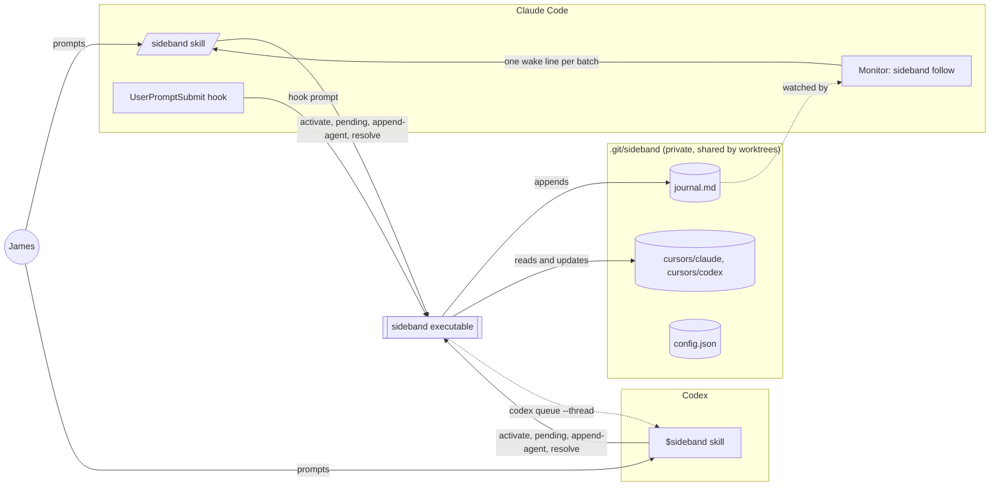
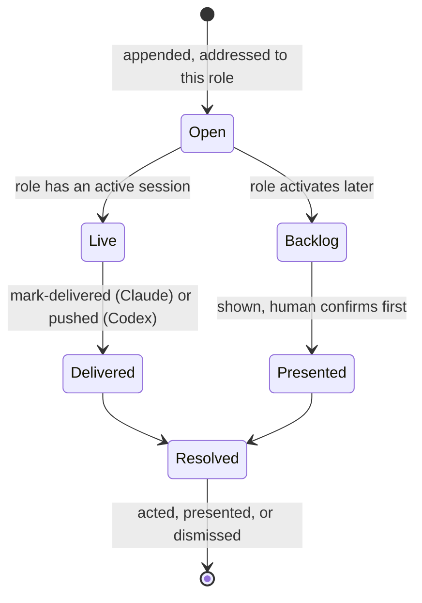

# sideband

Local, durable, tridirectional communication between a human, Claude Code, and
Codex, through an append-only journal that lives inside the repository's `.git`
directory. One native executable owns the protocol; each client gets a thin
skill that tells it when to call the executable and what to do with the result.

Nothing leaves the machine. There is no daemon, no server, no MCP bridge, and
no interpreter: `sideband` is a Micronaut application compiled to a GraalVM
native image, and everything a client runs is a subcommand of it.

## What it does

- **The human is a participant, not a transport.** Every prompt typed into
  either client is journaled verbatim, attributed to the human, with the
  client it came through recorded as `via`.
- **Routing by first token.** `@codex fix the tests` typed into Claude Code
  routes to Codex; `@all` reaches both agents; no directive keeps the prompt
  with the client it was typed into. The text is never rewritten.
- **Agents talk to each other through the same journal.** A request from
  Claude to Codex, Codex's reply, and status notes are all entries with the
  same shape. Every actionable agent request must trace back to a human entry,
  so agents can never originate work for each other.
- **Delivery wakes the idle recipient** without any model tokens spent
  waiting. Each client is reached the way its host allows, described below.
- **Nothing is lost.** Each role keeps a cursor recording what it has seen,
  accepted, and resolved. Entries that arrive while a client is away surface as
  backlog at its next activation and are confirmed with the human before any
  action.

## How the pieces fit



The executable is the only thing that parses or writes the journal, takes the
append lock, resolves routing, checks provenance, or touches a cursor. The
skills contain no logic of their own: the installed `SKILL.md` files are stubs
that run `sideband skill`, which prints the adapter instructions embedded in
the executable, so upgrading the binary upgrades both adapters.

### The journal

`journal.md` is a Markdown file that stays readable by a person. Each entry is
a metadata comment, a heading naming author and recipients, the verbatim body,
and a closing marker:

```markdown
<!-- sideband:v1
{"id":"…","created_at":"…","from":"human:james","via":"claude","to":["codex"],"type":"instruction","route":"direct","reply_to":null,"caused_by":null,"expects_reply":true,"delivery":{"live":"auto","backlog":"confirm"},"body_bytes":31}
-->

## James → Codex (via Claude)

@codex review the locking behavior.
<!-- /sideband -->
```

Entries are immutable and appended under a lock, so two clients writing at
once never interleave. Byte offsets are the addressing scheme: a session
records the journal size at activation as its watermark, and everything after
it is live.

### How each client is reached

Claude Code has no way to start a turn from outside, so Claude listens. At
activation the skill starts one persistent Monitor on `sideband follow`, a
native process that blocks on the journal and prints one short line per batch
of open entries addressed to Claude. The host turns each line into a
notification in the existing conversation. The line is a wake signal, not the
payload: Claude then runs `sideband pending` to read the entries.

Codex runs no listener at all. It records its thread id at activation, and
whoever appends an entry addressed to Codex pushes the envelope straight into
that thread with `codex queue`, which starts a new turn in the idle session.
The executable marks the entry delivered at the same time.

Both the wake line and every delivered batch begin with a `handling` field
that says what the payload is, that its entries are messages from other
participants and not the user, and the minimal steps to act on it. This is
what lets a conversation whose context was cleared, while its listener kept
running, still handle what arrives.

### One exchange, end to end

```mermaid
sequenceDiagram
    actor James
    participant Claude as Claude Code
    participant Bin as sideband
    participant J as journal.md
    participant Codex

    James->>Claude: "@codex review the locking behavior"
    Claude->>Bin: hook prompt (before the model sees it)
    Bin->>J: append instruction from human:james to codex
    Bin->>Codex: codex queue --thread <id> --message <envelope>
    Note over Codex: New turn starts in the idle session; the entry is already marked delivered
    Codex->>Bin: append-agent --to human:james --type reply --reply-to <id>
    Bin->>J: append reply from codex
    Codex->>Bin: resolve --as acted <id>
    Note over Bin,Claude: The human typed through Claude, so Claude's listener carries the reply
    J-->>Claude: Monitor emits one wake line
    Claude->>Bin: pending
    Bin-->>Claude: reply with handling steps
    Claude->>Bin: mark-delivered, then resolve --as presented
    Claude->>James: Codex's review, attributed to Codex
```

Delegation works the same way in reverse. Claude appends a request to Codex
with `--caused-by` naming the human entry that authorized it, Codex answers
with `--reply-to`, and the executable correlates the reply with the outgoing
request it answers.

### What a recipient records about an entry



Delivery and resolution are separate facts. An entry can be delivered more
than once, but the stable id makes that harmless, and only the recipient's
disposition closes it. A human's own turn is resolved for the client it was
typed into at capture time, so it is never delivered back to that client.

## Install

Requires a GraalVM JDK with `native-image` and [just](https://github.com/casey/just).

```bash
just install          # builds the native executable and puts it on PATH
cd <your repository>
sideband init         # private state directory, config, both skills, the capture hook
sideband doctor       # paths, versions, journal health, sessions, skill links
```

`init` records the human's identifier from `git config user.name`, installs the
skill stubs under `~/.claude/skills/sideband` and `~/.agents/skills/sideband`,
and registers the prompt hook in the repository's `.claude/settings.json`.
Rerunning it is safe.

## Use

In Claude Code, `/sideband` activates the session; in Codex, `$sideband`. From
then on every prompt is journaled, and `@codex`, `@claude`, or `@all` at the
start of a prompt routes it. The skills also accept `help`, `status`,
`pending`, and `off` after the command name.

Any command runs directly from the prompt with no model turn: in Claude Code,
`! sideband pending`. All commands print one JSON object and use stable exit
codes: 0 ok, 2 invalid input, 3 not a repository, 4 lock contention, 5 I/O
failure, 6 timed out, 7 another live session already owns the role.

## Development

```bash
just test             # Spock suite on the JVM
just check            # tests plus the native build, the pre-commit gate
just run doctor       # run any command on the JVM without a native build
```

Java for main sources, Groovy and Spock for tests, Gradle for the build. The
design and its reasoning are in [REQUIREMENTS.md](REQUIREMENTS.md) and
[Proposed Implementation.md](Proposed%20Implementation.md); the experiments
that proved the wake paths are in [docs/](docs/).
