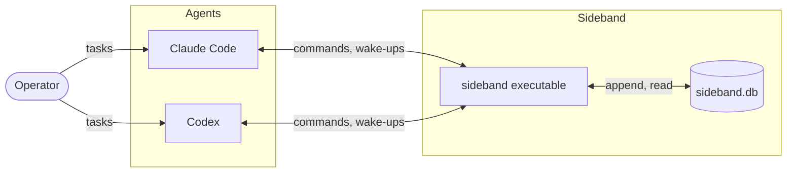
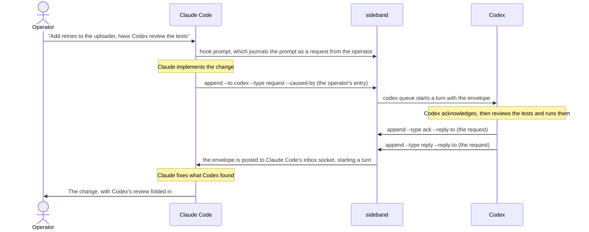

# sideband

Lets Claude Code and Codex work together on one task, in their own sessions,
with the human in the loop. The two agents talk through an append-only journal
that lives inside the repository's `.git` directory: one delegates, the other
answers, and each is woken in its own conversation when something arrives. One
native executable owns the protocol; each client gets a thin skill that tells
it when to call the executable and what to do with the result.

Nothing leaves the machine. There is no daemon, no server, no MCP bridge, and
no interpreter: `sideband` is a Micronaut application compiled to a GraalVM
native image, and everything a client runs is a subcommand of it.

- [1. Install](#1-install)
  - [1.1 Sideband](#11-sideband)
  - [1.2 Claude Code](#12-claude-code)
  - [1.3 Codex](#13-codex)
- [2. Use](#2-use)
  - [2.1 Claude Code](#21-claude-code)
  - [2.2 Codex](#22-codex)
  - [2.3 Either client](#23-either-client)
- [3. What it does](#3-what-it-does)
- [4. How the pieces fit](#4-how-the-pieces-fit)
  - [4.1 The journal](#41-the-journal)
  - [4.2 How each client is reached](#42-how-each-client-is-reached)
  - [4.3 What init sets up](#43-what-init-sets-up)
  - [4.4 One task, two agents](#44-one-task-two-agents)
  - [4.5 What is waiting for a role](#45-what-is-waiting-for-a-role)
- [5. Development](#5-development)

## 1. Install

### 1.1 Sideband

From the moltenbits Homebrew tap, on Apple silicon or on Linux (x86_64 or arm64):

```bash
brew tap moltenbits/tap
brew install sideband
```

Or from source, which needs a GraalVM JDK with `native-image` and
[just](https://github.com/casey/just):

```bash
just install          # builds the native executable and puts it on PATH
```

Set up the repository. `init` creates the state directory and database,
installs both skills, registers the hooks, and prints what to do next:

```bash
cd <your repository>
sideband init
```

Check the result at any time. `doctor` reports the database, both roles'
sessions, and every client item, and says where anything still needs your
attention:

```bash
sideband doctor
```

### 1.2 Claude Code

Let Claude Code accept pushes from Sideband, or Claude falls back to
listening. In Claude Code this is `/config`, "Messages from your other
sessions"; the same setting in `~/.claude/settings.json` is:

```json
{ "crossSessionInbound": "accept" }
```

Nothing else is needed: `init` installed the skill under
`~/.claude/skills/sideband` and the hooks in the repository's
`.claude/settings.json`.

### 1.3 Codex

Trust the hooks that `init` registered in the repository's
`.codex/hooks.json`, and again whenever a later `init` reports one as added
or updated:

```text
/hooks
```

Then `$sideband` joins and records this thread as Codex's delivery
address (section 2.2); after a later trust or a clear, an ordinary prompt
refreshes it. The skill is already installed under
`~/.agents/skills/sideband`.

## 2. Use

### 2.1 Claude Code

`/sideband` joins the discussion and resumes where Claude left off. Once
joined, every prompt you type is journaled as your own words, and `@codex`,
`@claude`, or `@all` at the start of a prompt routes it, with or without the
skill name in front:

```text
/sideband                     # join, and pick up where Claude left off
/sideband @codex <message>    # send Codex a request; @claude and @all route the same way
/sideband status              # summarize doctor: sessions, pending counts, database, clients
/sideband pending             # what is open, in progress, and unanswered for Claude
/sideband off                 # stop the listener if one is running; the bookmark stays
```

### 2.2 Codex

`$sideband` does the same in Codex. Codex runs nothing in the background:
entries are pushed to it by whoever writes them, and the prompt hook keeps
the delivery address current; `$sideband pending` is the explicit check for
waiting work:

```text
$sideband                     # join, and pick up where Codex left off
$sideband @claude <message>   # send Claude a request; @codex and @all route the same way
$sideband status              # summarize doctor: sessions, pending counts, database, clients
$sideband pending             # what is open, in progress, and unanswered for Codex
$sideband off                 # explains that there is no listener to stop
```

### 2.3 Either client

Any command runs directly from the prompt with no model turn:

```text
! sideband log                # the discussion as Markdown, oldest first
! sideband pending            # this client's pending report as JSON
! sideband doctor             # the installation report
```

The installed skills are stubs that read their instructions from the
executable, so a new release updates both. To edit the instructions yourself,
eject them inside the client; that writes them into the client's `SKILL.md`,
which is then yours and stops updating with the executable. Ejecting again
is refused so your edits survive, unless you pass `--force`; delete the file
and rerun `sideband init` to go back:

```bash
sideband skill --eject
```

Commands print one JSON object, except that `init` and `doctor` print
reports for a person to read, `skill` and `log` print Markdown, `--help`
prints text, the hook follows its host's contract and may print nothing, and
the streaming `pending --wait --stream` prints one report per line. Exit
codes are stable: 0 ok, 2 invalid input, 4 lock contention, 5 I/O failure,
6 timed out. Codes 3 and 7 are retired.

## 3. What it does

- **Agents delegate to each other and reply.** Claude asks Codex to review
  a change, Codex asks Claude to explain a design, either reports status.
  Requests, replies, and status notes are all journal entries of one shape,
  and a reply is correlated with the request it answers.
- **Every actionable chain traces to the human.** A human and an agent write
  the same kind of entry, a request. An agent's actionable request must link,
  through the requests and replies before it, to something the human asked;
  the executable refuses one that does not. Within that, one agent may direct
  the other's work for as long as the human's request stands.
- **Delivery wakes the idle recipient** in its existing conversation, without
  any model tokens spent waiting. Each client is reached the way its host
  allows, described below.
- **The human is a participant, not a transport.** Every prompt typed into
  either client is journaled verbatim and attributed to the human. Normally
  each agent is spoken to in its own session; `@codex` at the start of a
  prompt typed into Claude Code routes it to Codex anyway, `@claude` does the
  reverse, and `@all` reaches both.
- **Nothing is lost, and nothing is tracked outside the journal.** A request
  stays listed for its recipient until the journal holds that recipient's
  acknowledgement or reply, and listed for its sender until a reply exists.
  Requests that arrived while a client was away are confirmed with the human
  before any action. The only thing kept beside the journal is each role's
  session record: how far it has read, and for Codex the thread to push into.
  Whoever joins as a role last holds it; one client per role per repository is
  a convention the operator keeps, not something the executable polices.

## 4. How the pieces fit



The executable is the only thing that reads or writes the journal, resolves
routing, checks provenance, or touches a session record. The
skills contain no logic of their own: the installed `SKILL.md` files are stubs
that run `sideband skill`, which prints the adapter instructions embedded in
the executable, so upgrading the binary upgrades both adapters.

### 4.1 The journal

`sideband.db` is one SQLite database in the state directory holding every
entry and both roles' session records. An entry is its metadata plus the
verbatim body; every command prints it as JSON, and `sideband log` prints the
whole discussion as Markdown for a person to read:

```markdown
## Operator → Codex (via Claude)

- position: 12
- id: …
- created: 2026-09-07T18:07:52-05:00
- type: request (expects a reply)
- to: codex

@codex review the locking behavior.

---
```

Entries are immutable and inserted in transactions that SQLite serializes
across processes, so two clients writing at once never interleave. Positions
are the addressing scheme: each entry gets the next sequence number, a session
records the last position when it joins as its watermark, and everything
after it is live. A state directory from before the database still holds
`journal.md` and `sessions/`; nothing reads them, and they can be deleted.

### 4.2 How each client is reached

Whoever appends an entry pushes the complete envelope into the recipient's
running session, which starts a new turn there when the session is idle; the
recipient reads the entry from that message and acts on it directly. Neither
client needs a listener for that, though Claude keeps one as a fallback,
described below.

Claude Code registers every session in `~/.claude/sessions/<pid>.json` with
its working directory and an inbox socket, the channel its own cross-session
messaging uses. The writer finds the registered session working in this
repository, worktrees included, and posts the envelope to its socket as one
newline-terminated frame. No Sideband record is involved, so a Claude Code
session that has never run `/sideband` is reached too; it loads the skill from
the envelope's first line. A socket that refuses the connection belongs to a
session that has ended, and the entry then waits in the journal.

Claude Code introduces everything on that socket to the model as a message
from another Claude session; no frame can change that. The frame does carry
the shape Claude Code's own cross-session messaging uses, a
`<cross-session-message>` tag whose `from-name` Claude Code parses into the
message's origin, so the envelope arrives named for its author: Codex, or the
operator, rather than an anonymous session.

The socket is used whenever it can be, and the executable falls back to a
listener when it cannot. Claude Code delivers such a frame only when your
user settings accept cross-session messages (section 1.2); otherwise it
would hold every one for your approval. So each time an entry for Claude is
appended, the executable checks your settings: if they accept, it posts the
frame; if not, it posts nothing and reports that Claude's listener delivers.
The Claude skill makes the same check when it activates, through
`sideband doctor`, and starts a listener only in the second case: one
persistent Monitor on `sideband pending --wait --stream`, a native process
that blocks on the journal and prints one line per batch of new entries;
the host turns each line into a notification, and Claude then reads the
entries with `sideband pending`. Nothing is configured for this beyond your
settings, and changing them takes effect the next time `/sideband` runs.

Codex has no such registry. It records its thread id when it joins, and the
writer pushes the envelope into that thread with `codex queue`. That address
follows you: `/clear` in Codex starts a new thread and leaves the old one
loaded, where a queued envelope would run unseen, so the hooks move the role
to the new thread: the session-start hook when Codex runs it for the clear,
and the prompt hook whenever a prompt you type comes from a thread other
than the recorded one. Only your own input moves it; a delivered envelope
never does. One window remains. Codex runs both hooks only when you submit
your first prompt in the new thread, not at the clear itself, and in the
tested Codex 0.153.4 TUI setup Sideband has no supported way to identify
the thread on screen during that window. So **after `/clear` in Codex, type
one prompt before expecting delivery**. An entry pushed in between can be
handled by the old thread and its reply recorded in the Sideband discussion
without appearing in the new conversation. `pending` lists unanswered work
and unread incoming updates; it does not replay Codex's completed replies.
The same hooks run in Claude Code, where the socket is found by process and
the move is only bookkeeping.

Every envelope and every `pending` report begin with an `intent` field that
says only "Sideband delivery; use the Sideband skill (/sideband) for handling
instructions". That is what lets a conversation whose context was cleared, or
one that never joined, find the skill and handle what arrives.

### 4.3 What init sets up

`init` creates the private state directory with its database, installs the
skill stubs under `~/.claude/skills/sideband` and `~/.agents/skills/sideband`,
and registers two commands in the repository's `.claude/settings.json` and
`.codex/hooks.json`, each naming its client with `--agent claude` or
`--agent codex`: `sideband hook prompt` under `UserPromptSubmit`, and
`sideband hook session-start` under `SessionStart` with the matcher `clear`.
Rerunning it is safe. `doctor` reports each client's registration as
missing when the file is absent or holds no Sideband command, stale when it
is incomplete or has the session-start command under another matcher, and
installed otherwise.

One setting is yours to make, and without it Claude falls back to listening.
A pushed envelope reaches Claude Code from a process that is not the
session's own child, and a session run with bypass permissions holds such a
message for your approval unless `crossSessionInbound` is `accept` in your
user settings,
`~/.claude/settings.json` (or `/config`, "Messages from your other
sessions"). Claude Code lets a repository's `.claude/settings.json` and
`.claude/settings.local.json` only tighten that value, so `init` does not
write it; `doctor` reports whether pushes will be delivered, held, or refused,
names the file that decided, and says where accept must go. Managed settings
and `--settings`, which it cannot read, take the place of your user file as
the base; a repository's tightening still applies over them.
In Codex, review and trust the hooks through `/hooks`, and again whenever
`init` adds or changes a definition in `.codex/hooks.json`. Codex binds
trust to each definition's hash and skips an untrusted definition; an
unchanged, already trusted one keeps running. Codex warns at startup when
hooks need review, but `doctor` checks registration, not host trust, so a
skipped hook looks installed to it. After trusting, type one prompt to
refresh the current delivery address. The trust entries land in your Codex
`config.toml`. Claude Code needs nothing beyond the `crossSessionInbound`
setting in section 1.2.

The hook is the only thing that records prompts: when it cannot, it tells
the model to tell you, and no client records a prompt on its behalf. The
registration names the client because both hosts send the same payload and
Codex gives hook shells no environment markers. Nothing else about the
caller matters: a prompt is recorded for its client's role whenever that
role has joined here, whichever conversation or process is running the hook,
so restarting a client needs nothing. Clearing a context is handled by the
hooks described above: the role follows you into the new conversation at
your first prompt there, and that conversation opens with a note saying
Sideband is live there and how many entries addressed to it need attention,
acknowledged ones included. In Codex, type that first prompt before you
expect anything to be delivered to the new thread.

### 4.4 One task, two agents



The request carries `--caused-by`, naming the human entry that authorized the
delegation, and the reply carries `--reply-to`, naming the request. Nothing
here needed the operator to relay anything, and the operator could have spoken to Codex in
its own session at any point, including to redirect the review while Claude
was still waiting for it. Waiting costs nothing: Claude's conversation stays
free for the operator until the reply arrives.

### 4.5 What is waiting for a role

Nothing about it is stored. `pending` derives it from the journal on every
read: a request is open until the role's ack exists and in progress until its
reply exists, and the same two entries tell the sender that its request was
received and then answered, and how long it has been silent since. There is
no deadline; the sender decides what to do. The only thing a role keeps beside
the journal is its session record, identity and how far it has read, so
informational updates are shown once.

## 5. Development

```bash
just test             # Spock suite on the JVM
just check            # tests plus the native build, the pre-commit gate
just run doctor       # run any command on the JVM without a native build
```

Java for main sources, Groovy and Spock for tests, Gradle for the build. The
design and its reasoning are in [REQUIREMENTS.md](REQUIREMENTS.md).
