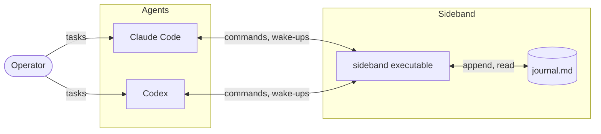
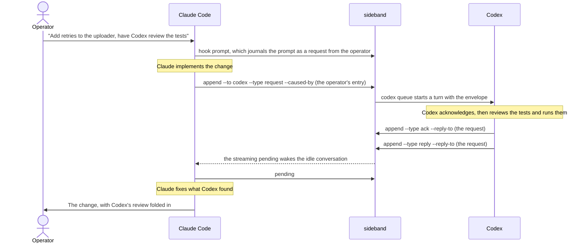

# sideband

Lets Claude Code and Codex work together on one task, in their own sessions,
with the human in the loop. The two agents talk through an append-only journal
that lives inside the repository's `.git` directory: one delegates, the other
answers, and each is woken in its own conversation when something arrives. One
native executable owns the protocol; each client gets a thin skill that tells
it when to call the executable and what to do with the result.

Nothing leaves the machine. There is no daemon, no server, no MCP bridge, and
no interpreter: `sideband` is a Micronaut application compiled to a GraalVM
native image, and everything a client runs is a subcommand of it.

## What it does

- **Agents delegate to each other and reply.** Claude asks Codex to review
  a change, Codex asks Claude to explain a design, either reports status.
  Requests, replies, and status notes are all journal entries of one shape,
  and a reply is correlated with the request it answers.
- **Every actionable chain traces to the human.** A human and an agent write
  the same kind of entry, a request. An agent's actionable request must link,
  through the requests and replies before it, to something the human asked;
  the executable refuses one that does not. Within that, one agent may direct
  the other's work for as long as the human's request stands.
- **Delivery wakes the idle recipient** in its existing conversation, without
  any model tokens spent waiting. Each client is reached the way its host
  allows, described below.
- **The human is a participant, not a transport.** Every prompt typed into
  either client is journaled verbatim and attributed to the human. Normally
  each agent is spoken to in its own session; `@codex` at the start of a
  prompt typed into Claude Code routes it to Codex anyway, `@claude` does the
  reverse, and `@all` reaches both.
- **Nothing is lost, and nothing is tracked outside the journal.** A request
  stays listed for its recipient until the journal holds that recipient's
  acknowledgement or reply, and listed for its sender until a reply exists.
  Requests that arrived while a client was away are confirmed with the human
  before any action. The only thing kept beside the journal is each role's
  session record: how to reach it and how far it has read. Whoever joins as a
  role last holds it; one client per role per repository is a convention the
  operator keeps, not something the executable polices.

## How the pieces fit



The executable is the only thing that parses or writes the journal, takes the
append lock, resolves routing, checks provenance, or touches a session record. The
skills contain no logic of their own: the installed `SKILL.md` files are stubs
that run `sideband skill`, which prints the adapter instructions embedded in
the executable, so upgrading the binary upgrades both adapters.

### The journal

`journal.md` is a Markdown file that stays readable by a person. Each entry is
a metadata comment, a heading naming author and recipients, the verbatim body,
and a closing marker:

```markdown
<!-- sideband:v1
{"id":"…","created_at":"…","from":"operator","via":"claude","to":["codex"],"type":"request","route":"direct","reply_to":null,"caused_by":null,"expects_reply":true,"delivery":{"live":"auto","backlog":"confirm"},"body_bytes":31}
-->

## Operator → Codex (via Claude)

@codex review the locking behavior.
<!-- /sideband -->
```

Entries are immutable and appended under a lock, so two clients writing at
once never interleave. Byte offsets are the addressing scheme: a session
records the journal size when it joins as its watermark, and everything after
it is live.

### How each client is reached

Claude Code has no way to start a turn from outside, so Claude listens. When
it joins, the skill starts one persistent Monitor on
`sideband pending --wait --stream`, a native process that blocks on the
journal and prints one report per batch of new entries for Claude. The host turns each line into a notification in
the existing conversation. The notification is a wake signal, not the
payload: Claude then runs `sideband pending` to read the entries, which is
what marks updates as shown.

Codex runs no listener at all. It records its thread id when it joins, and
whoever appends an entry addressed to Codex pushes the complete entry straight
into that thread with `codex queue`, which starts a new turn in the idle
session. Codex reads the entry from that message and acts on it directly.

Every report and every delivered batch begin with an `intent` field
that says only "Sideband delivery; use the Sideband skill (/sideband) for
handling instructions". That is what lets a conversation whose context was
cleared, while its listener kept running, find the skill and handle what
arrives.

### One task, two agents



The request carries `--caused-by`, naming the human entry that authorized the
delegation, and the reply carries `--reply-to`, naming the request. Nothing
here needed the operator to relay anything, and the operator could have spoken to Codex in
its own session at any point, including to redirect the review while Claude
was still waiting for it. Waiting costs nothing: Claude's conversation stays
free for the operator until the reply arrives.

### What is waiting for a role

Nothing about it is stored. `pending` derives it from the journal on every
read: a request is open until the role's ack exists and in progress until its
reply exists, and the same two entries tell the sender that its request was
received and then answered, and how long it has been silent since. There is
no deadline; the sender decides what to do. The only thing a role keeps beside
the journal is its session record, identity and how far it has read, so
informational updates are shown once.

## Install

Requires a GraalVM JDK with `native-image` and [just](https://github.com/casey/just).

```bash
just install          # builds the native executable and puts it on PATH
cd <your repository>
sideband init         # private state directory, both skills, the capture hook
sideband doctor       # paths, versions, discussion health, sessions, skill links
```

`init` creates the private state directory, installs the skill stubs under `~/.claude/skills/sideband` and `~/.agents/skills/sideband`,
and registers the `sideband hook prompt` command in the repository's
`.claude/settings.json` and `.codex/hooks.json`, each naming its client with
`--agent claude` or `--agent codex`. Rerunning it is safe.
In Codex, review and trust the new hook through `/hooks`; a registered command
is not necessarily enabled or trusted by the host. The hook is the only thing
that records prompts: when it cannot, it tells the model to tell you, and no
client records a prompt on its behalf. The registration names the client
because both hosts send the same payload and Codex gives hook shells no
environment markers. Nothing else about the caller matters: a prompt is
recorded for its client's role whenever that role has joined here, whichever
conversation or process is running the hook, so restarting a client or
clearing its context needs nothing.

## Use

In Claude Code, `/sideband` joins the discussion; in Codex, `$sideband`. From
then on every prompt is journaled, and `@codex`, `@claude`, or `@all` at the
start of a prompt routes it. The skills also accept `help`, `status`,
`pending`, and `off` after the command name.

The installed skills are stubs that read their instructions from the
executable, so a new release updates both. To edit the instructions yourself,
run `sideband skill --eject` inside the client: it writes them into that
client's `SKILL.md`, which is then yours and stops updating with the
executable. Ejecting again is refused so your edits survive, unless you pass
`--force`. Delete the file and rerun `sideband init` to go back.

Any command runs directly from the prompt with no model turn: in Claude Code,
`! sideband pending`. Commands print one JSON object, except that `skill`
prints Markdown, `--help` prints text, the hook follows its host's contract
and may print nothing, and the streaming `pending` prints one report per
line, and use stable exit codes: 0 ok, 2 invalid input, 4 lock
contention, 5 I/O failure, 6 timed out. Codes 3 and 7 are retired.

## Development

```bash
just test             # Spock suite on the JVM
just check            # tests plus the native build, the pre-commit gate
just run doctor       # run any command on the JVM without a native build
```

Java for main sources, Groovy and Spock for tests, Gradle for the build. The
design and its reasoning are in [REQUIREMENTS.md](REQUIREMENTS.md).
